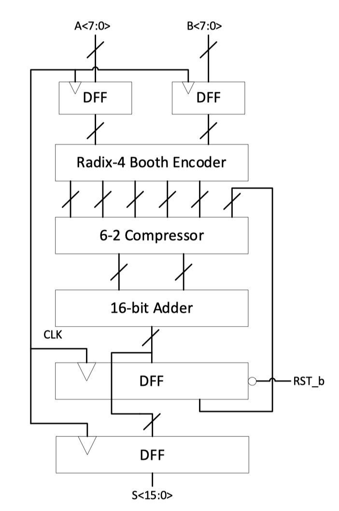
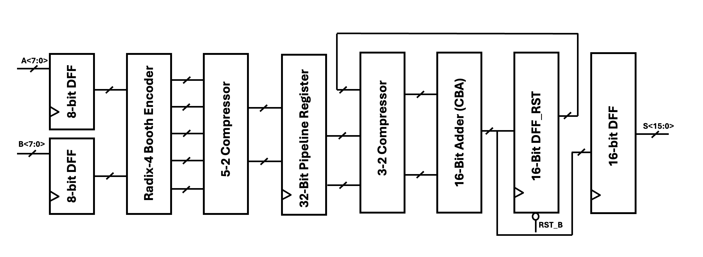
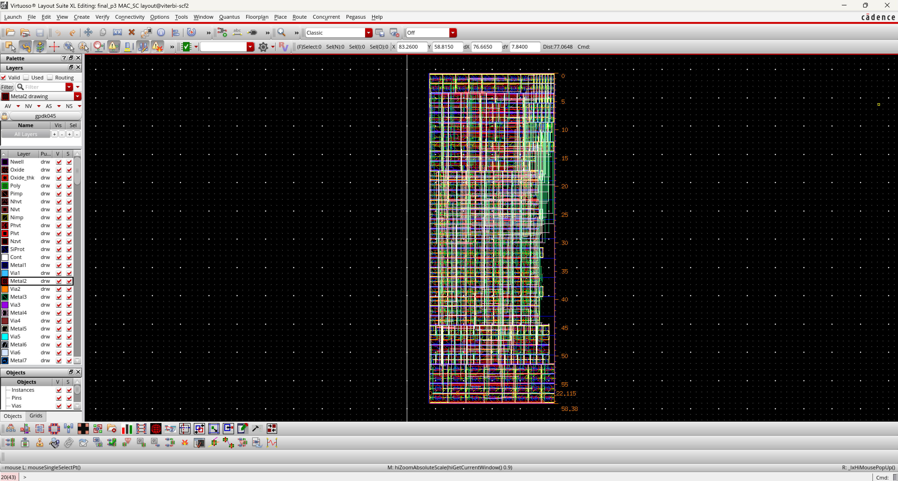
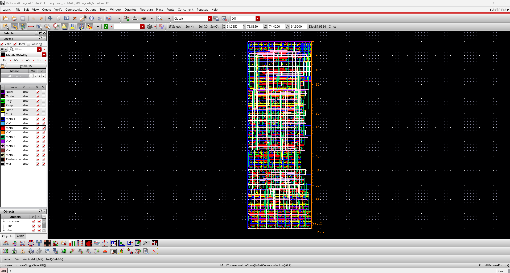
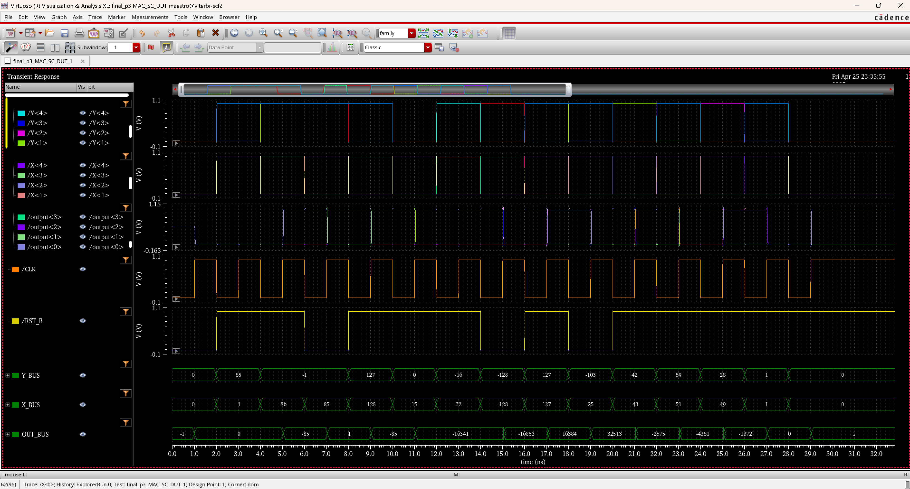

# Full-Custom-MAC-Unit-Design
This repo contains one single-cycle MAC unit design and one two-stage pipeline MAC unit design with Carry Bypass Adder (CBA) as accumulator, using Radix-4 Booth encoding. The design is based on transistor-level, i.e., full-custom design.

The single cycle design originates from course project, and it was extended to pipeline design for best project competition. Both designs excelled in PAD metrics and I won the top design award :-)

## Key Features
- All designs under 1.0V.
- Full-custom MAC unit based on GPDK045, with Metal 5 top layer.
- 8-bit radix-4 Booth encoding multiplier.
- 16-bit Carry Bypass Adder (optimal compared to Ripple Carry Adder, Carry Look-Ahead Adder, and Han-Carlson Adder).
- Minimum area design: 1291 $um^2$ for single-cycle; 1441 $um^2$ for two-stage pipeline design with additional 32 pipeline registers. 
- Optimized delay performance and maximum clock frequency: The maximum clock frequency for the single-cycle design is 225MHz (clock period 4.4ns) with worst-case CBA carry propagation, and a maximum of 417MHz (clock peroid 2.4ns) for the pipeline design.
- Low power consumption (average 408uW for single-cycle @225MHz, 570uW for pipeline @417MHz)

## Design Details
The single-cycle design follows the block diagram shown in below:

Also the pipeline design block diagram:

Layout screenshot for single-cycle design:

Layout screenshot for pipeline design:

Intended MAC test cases:

Function Verification

