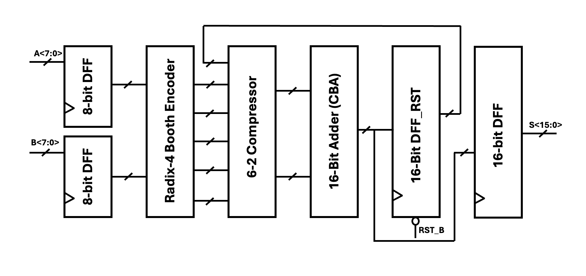

# Full-Custom-MAC-Unit-Design
This repo contains one single-cycle MAC unit design and one two-stage pipeline MAC unit design with Carry Bypass Adder (CBA) as accumulator, using Radix-4 Booth encoding. The design is based on transistor-level, i.e., full-custom design.

## Key Features
- All designs under 1.0V.
- Full-custom MAC unit based on GPDK045.
- 8-bit radix-4 Booth encoding multiplier.
- 16-bit Carry Bypass Adder (optimal compared to Ripple Carry Adder, Carry Look-Ahead Adder, and Han-Carlson Adder.
- Minimum area design: 0.95mW per MAC operation with area 1291 $um^2$ for single-cycle; 1441 $um^2$ for two-stage pipeline design with additional 32 pipeline registers. 
- Optimized delay performance and maximum clock frequency: The maximum clock frequency for the single-cycle design is 225MHz with worst-case CBA carry propagation, and it is a maximum of 417MHz for the pipeline design.
- Low power consumption (average 408uW for single-cycle @225MHz, 570uW for pipeline @417MHz)

## Design Details
The single-cycle design follows the block diagram shown in below:

Also the pipeline design block diagram:

